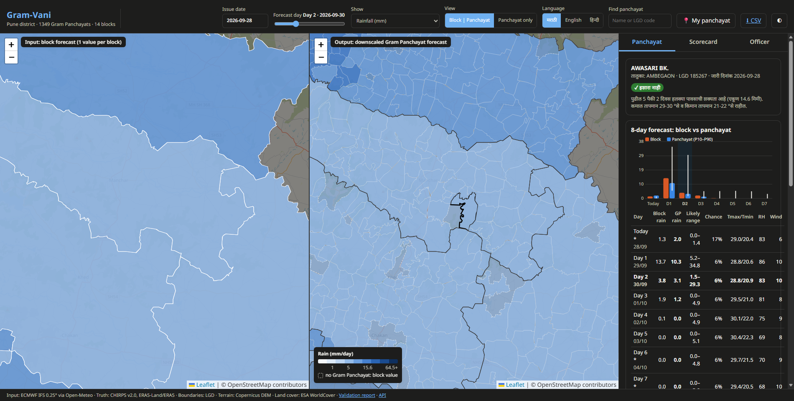
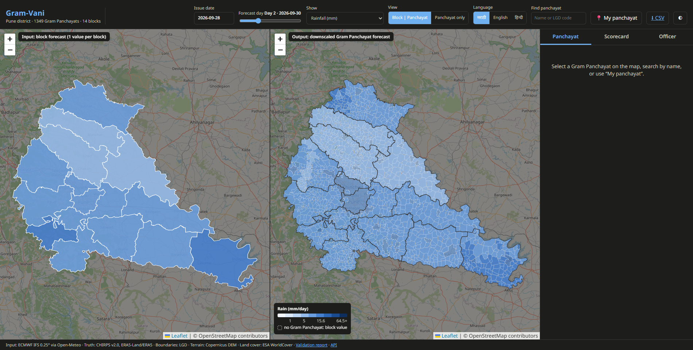
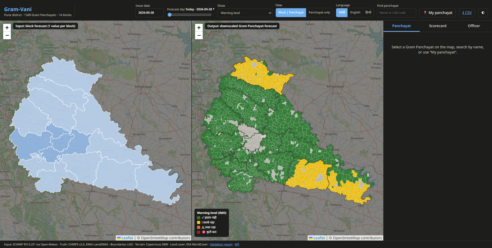
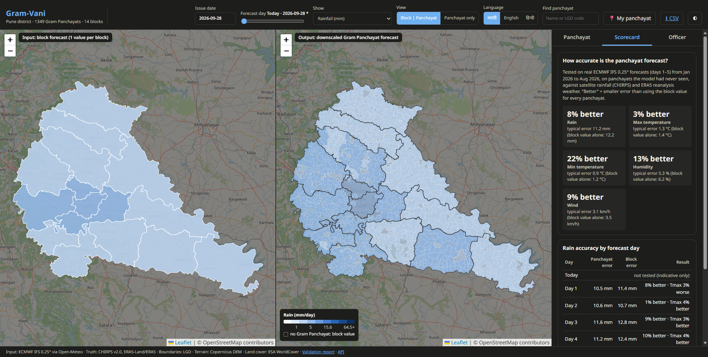
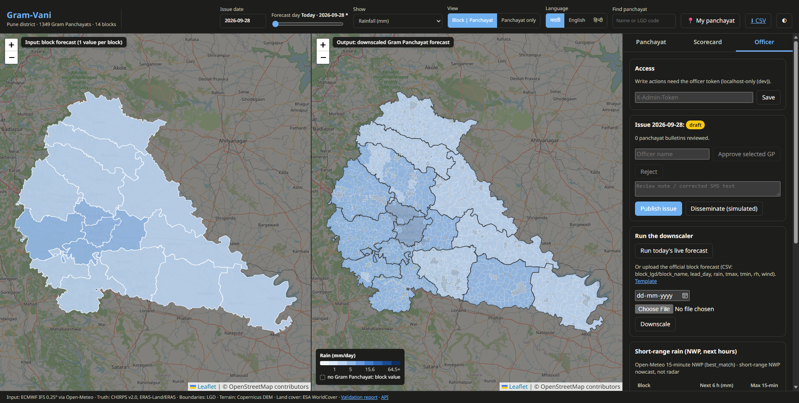
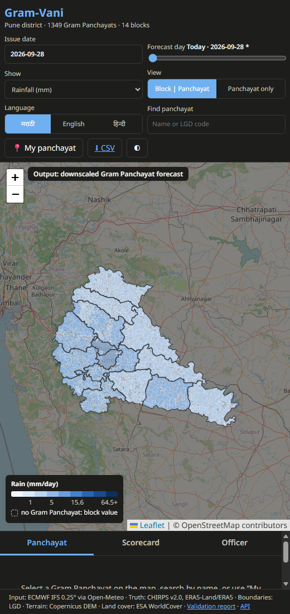

# Gram-Vani: Panchayat-level Weather Forecasts and Agromet Advisories

Block-level weather forecasts downscaled to every Gram Panchayat, with crop advisories in Marathi, Hindi and English.



## 1. Project Information

- **Project Title:** Gram-Vani: Block → Gram Panchayat weather downscaling for agromet advisories
- **PS ID:** SIH26074
- **PS Title:** Downscaling of weather forecast from Block level to Panchayat level: inferring high-resolution
  plots/data/information from low-resolution plot/data/information/variables for agro-meteorological advisory services
- **Category:** Software
- **Theme:** Agriculture, FoodTech & Rural Development
- **Team:** W.A.V.E

| Member | Role |
|---|---|
| Akshit Agrawal | Team Leader |
| Aveeral Jain | Member |
| Shreyansh Rastogi | Member |
| Uddip Jain | Member |
| Aayura Shankar Upadhyay | Member |
| Indrina Gupta | Member |

## 2. Problem Statement

Agromet advisories in India (GKMS) are issued per **block**: one rainfall and temperature value for an area of about
1,000 km² and around 100 villages. Inside one block, conditions can differ sharply. In Pune district a single block can
run from the Western Ghats crest (over 1,400 m, 3,000+ mm of rain a year) to the Deccan rain-shadow (about 500 m, under
600 mm). A farmer's decision (sow, spray, irrigate, harvest) depends on the weather of their own panchayat, not the
block average.

## 3. Proposed Solution

Gram-Vani takes the block forecast (one value per block, as in the official bulletins) and infers the forecast for
every **Gram Panchayat** inside it. A machine-learning model learns, from two years of real archived forecasts and
observations, how each panchayat systematically differs from its block (terrain, distance from the Ghat crest,
land cover, rivers, soil, vegetation and rain climatology). The panchayat forecast then drives crop- and stage-aware
advisories, issued as bulletins, SMS and IVR scripts in three languages.

**Pilot:** Pune district, Maharashtra: 14 blocks, **1,349 Gram Panchayats** (LGD boundaries).

## 4. Key Features

- **Daily live forecast, today + 7 days:** each morning, the latest ECMWF block forecast is downscaled to all
  1,349 panchayats automatically. Days 1–5 are the validated range; today and days 6–7 are shown as indicative.
- **Five variables:** rainfall, max/min temperature, humidity and wind, with a likely range (P10–P90) and rain
  probabilities (≥ 2.5 / 15.6 / 64.5 mm).
- **Explainable:** "why this panchayat differs from its block" (terrain, climatology, land cover …) for every forecast.
- **IMD colour-coded warnings** (heavy rain, heat, cold/frost, wind, thunderstorm, waterlogging), driven by weather only.
- **Crop advisories** for 11 crops by block and growth stage: irrigation amounts (FAO-56 ET0 × Kc), spray and
  fertiliser windows, sowing and harvest windows, and 9 weather-driven disease/pest risk models.
- **Bulletins in मराठी / हिन्दी / English:** PDF, text, SMS (≤ 160 characters) and IVR script.
- **Dashboard:** block-vs-panchayat maps side by side, day slider, search or GPS "my panchayat", accuracy scorecard,
  officer review/approve/publish workflow, CSV upload of an official block forecast, offline-capable (PWA),
  shareable links (`?gp=<LGD code>&day=<n>`).
- **Honest by design:** every score comes from the pipeline's evaluation files; inputs that are missing on a given
  day are reported on the dashboard instead of being guessed.
- **Configurable:** every threshold, rule, map colour and district setting lives in YAML under `config/`; a new
  district needs a new config file, not new code.

## 5. Technology Stack

- **Frontend:** HTML, CSS, JavaScript, Leaflet (maps), Progressive Web App (offline)
- **Backend:** Python, FastAPI, Uvicorn, SQLite (review workflow, subscriptions, audit log)
- **Machine Learning:** XGBoost (residual downscaling, multi-quantile), scikit-learn (isotonic calibration),
  Optuna (tuning), SHAP (explanations), PyTorch (U-Net comparison only)
- **Geospatial:** GeoPandas, Shapely, Rasterio, xarray
- **Data sources (all real, open):** ECMWF IFS 0.25° via Open-Meteo, CHIRPS v2.0, ERA5-Land / ERA5, IMD gridded
  rainfall, Copernicus DEM 30 m, ESA WorldCover 10 m, HydroRIVERS, SoilGrids, MODIS NDVI, LGD boundaries
- **Bulletins:** fpdf2 with HarfBuzz shaping and Noto fonts (Devanagari)
- **Deployment:** Docker; GitHub Actions (CI + daily forecast job)

## 6. Architecture

See [docs/architecture.md](docs/architecture.md).

```text
ECMWF block forecast (Open-Meteo)          static panchayat features (terrain, land cover,
        │                                   rivers, soil, NDVI, rain climatology)
        ▼                                               │
  Downscaling model (XGBoost, one per variable) ◄───────┘
        │   point forecast, P10–P90, rain probabilities, SHAP explanation
        ▼
  Advisory engine (YAML rules, crop calendar, ET0, disease models)
        │
        ▼
  Bulletins mr/hi/en (PDF, SMS, IVR)  ──►  FastAPI  ──►  Gram-Vani dashboard (maps, scorecard, officer)
```

## 7. Repository Structure

```text
sih074/
├── README.md
├── SUBMISSION_GUIDE.md
├── submission/
│   ├── PRESENTATION.md          final PPT (or its link)
│   └── DEMO.md                  demo video link
├── src/
│   ├── main.py                  app entry point (uvicorn src.main:app)
│   ├── common/                  config, paths, HTTP (rate-limit aware), geo area-weighting, provenance
│   ├── ingest/                  data downloaders: boundaries, NWP, CHIRPS, ERA5, IMD, terrain, land cover, …
│   ├── features/                static covariates, training/inference dataset, leakage-free bias encoder
│   ├── models/                  downscaler, baselines, tuning, training, evaluation, report
│   ├── advisory/                rules, crop calendar, ET0, disease models, bulletins, i18n (mr/hi/en)
│   ├── pipeline/                one-command runner, live inference, daily scheduler, publishing
│   └── dashboard/               FastAPI app, SQLite store, web app (HTML/CSS/JS)
├── config/                      district, model, advisory rules, disease models, crop calendar, dashboard (YAML)
├── tests/                       unit + integration tests (pytest)
├── docs/
│   ├── architecture.md          components and data flow
│   ├── data.md                  data dictionary and provenance (generated)
│   ├── development.md           development workflow and rules
│   └── stations_template.csv    format for adding weather-station validation data
├── assets/
│   └── screenshots/             dashboard screenshots
├── data/                        pipeline data (downloads are git-ignored, regenerated by the pipeline)
├── outputs/                     models, reports, daily forecasts (runtime files git-ignored)
├── Dockerfile
├── pyproject.toml
├── requirements.txt
├── .gitignore
└── LICENSE
```

### What goes where?

| Item | Location |
|---|---|
| Source code | `src/` |
| Settings (thresholds, rules, district, map) | `config/` |
| Architecture / technical documentation | `docs/` |
| Screenshots | `assets/screenshots/` |
| Final PPT / presentation | `submission/` |
| Demo video link | `submission/DEMO.md` |
| Validation report (figures, all scores) | `outputs/pune/reports/report.html` (also at `/api/report`) |

## 8. Results

Generated from `outputs/pune/reports/evaluation.json` by `python -m src.pipeline.run --only docs`; no number here
is typed by hand. All scores are on **Gram Panchayats never seen in training** (20 % spatial hold-out) over a
**test period never used for fitting**, against the naive "copy the block value" baseline, with 95 % bootstrap
confidence intervals.

<!-- RESULTS:START -->
Skill = RMSE reduction vs copying the block value; test period 2026-01-01 to 2026-08-31; lead days 1-5.

| Variable | Disaggregation (observed block in) | Forecast mode (ECMWF block in) | Forecast-mode error: panchayat vs block copy |
|---|---|---|---|
| Rainfall | +18.8% (CI +10.0% to +22.8%) | +7.7% (CI -0.6% to +17.0%) | 11.22 vs 12.16 |
| Max temperature | +48.6% (CI +45.6% to +51.4%) | +3.3% (CI -8.9% to +17.6%) | 1.31 vs 1.36 |
| Min temperature | +26.6% (CI +23.4% to +30.3%) | +22.1% (CI +16.3% to +27.6%) | 0.93 vs 1.19 |
| Humidity | +41.7% (CI +36.5% to +46.1%) | +13.3% (CI +3.9% to +24.1%) | 5.34 vs 6.16 |
| Wind | +31.2% (CI +24.4% to +36.4%) | +9.4% (CI +5.9% to +14.4%) | 3.14 vs 3.46 |
<!-- RESULTS:END -->

- **Disaggregation** answers the problem statement directly: given the block value, how well is each panchayat's
  value recovered?
- **Forecast mode** uses the real ECMWF block forecast, so it also contains the weather model's own error, which no
  spatial method can remove; its gains are smaller.

## 9. Final Presentation

See [submission/PRESENTATION.md](submission/PRESENTATION.md).

## 10. Demo Video

See [submission/DEMO.md](submission/DEMO.md).

## 11. Screenshots

| | |
|---|---|
|  Block input vs panchayat output |  Panchayat forecast and advisories |
|  IMD warning levels |  Accuracy scorecard |
|  Officer workflow |  Mobile view |

More in [assets/screenshots/](assets/screenshots/README.md).

## 12. Installation and Run

```bash
git clone <YOUR_REPOSITORY_URL>
cd sih074
python -m venv .venv
.venv/Scripts/activate            # Windows  (Linux/macOS: source .venv/bin/activate)
pip install -r requirements.txt
pip install --no-deps -e .
```

**Build the data and model** (resumable; finished stages are skipped):

```bash
python -m src.pipeline.run
```

The free Open-Meteo tier allows 10,000 calls a day and a first full download for one district needs about 15,000, so
the first build takes two days; downloads are cached and resume automatically.

**Run the dashboard** (issues today's forecast automatically each morning while running):

```bash
uvicorn src.main:app --port 8080
```

Open http://127.0.0.1:8080 (API documentation at `/docs`).

**Other commands**

| Task | Command |
|---|---|
| Issue today's forecast now | `python -m src.pipeline.scheduler --force` |
| Tests | `pytest` |
| Another district | copy `config/district_pune.yaml` and a crop calendar, then `python -m src.pipeline.run --config config/district_<name>.yaml` |
| Docker | `docker build -t gram-vani . && docker run -p 8080:8080 -v $PWD/data:/app/data -v $PWD/outputs:/app/outputs gram-vani` |

Officer write actions (review, publish, run, upload) are localhost-only unless `AGROMET_ADMIN_TOKEN` is set; see
`.env.example`.

## 13. Future Scope

- **Official block forecasts:** retrain on an archive of IMD GKMS block bulletins once available (the dashboard
  already accepts them by CSV upload).
- **Station truth:** add IMD AWS / Maharashtra Mahavedh station data as independent validation
  ([docs/stations_template.csv](docs/stations_template.csv)).
- **Radar nowcasting:** replace the short-range NWP layer with Doppler radar / INSAT-3D rainfall.
- **More districts:** roll out district by district through config files (no code changes).
- **Real dissemination:** connect the simulated SMS/WhatsApp/IVR outbox to a DLT-registered SMS gateway.
- **Farmer feedback:** collect ground reports through the app to improve rainfall truth where satellites are weak.

## Limitations

- CHIRPS (0.05°) is the finest free daily rainfall product but is not a rain gauge; its daily timing is weaker than its
  multi-day totals.
- Temperature, humidity and wind truth are reanalysis products; wind (ERA5, 0.25°) is coarser than a panchayat.
- The model is trained on ECMWF forecasts; official IMD block values have different error characteristics.

## Licence

Code: [MIT](LICENSE). Data products keep their own licences (see [docs/data.md](docs/data.md)). Fonts: Noto Sans (SIL OFL 1.1).
